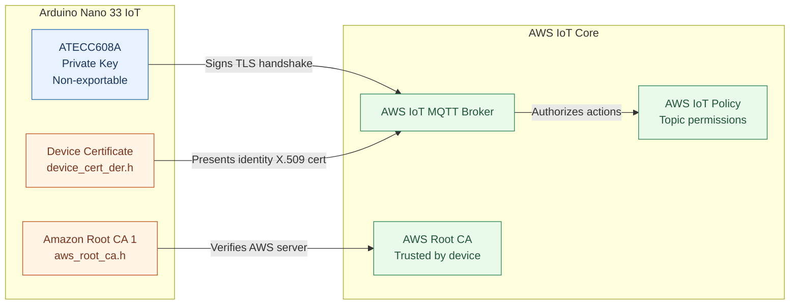
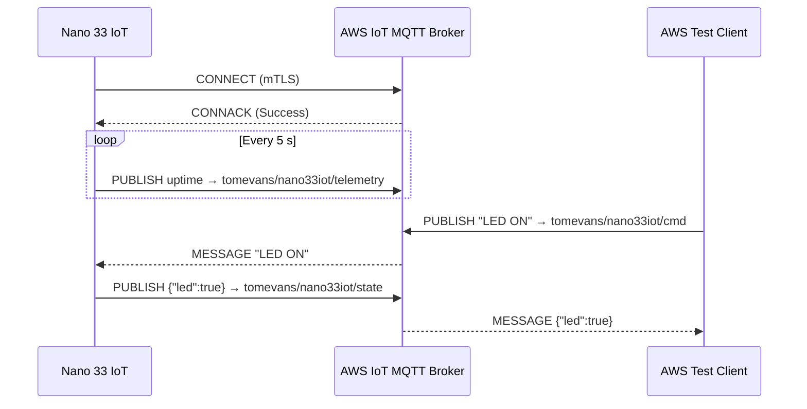

# Nano 33 IoT ↔ AWS IoT Core Secure MQTT Demo

## 🧠 Project Intention

This project demonstrates an **end-to-end secure MQTT link** between an **Arduino Nano 33 IoT** and **AWS IoT Core** using **mutual TLS (mTLS)**.

It was developed as an educational example—with the help of **ChatGPT**—to teach embedded engineers how to:

- Connect securely to AWS IoT Core from hardware  
- Understand certificates, private keys, and policies  
- Publish and subscribe MQTT messages safely  

---

## 🧩 Demo Operation

- The device connects securely to AWS IoT Core.  
- Every 5 seconds it publishes its uptime (ms) to the topic:

```tomevans/nano33iot/telemetry```

- The AWS IoT test client can send commands with payloads:

```"LED ON" or "LED OFF"```

- The Nano toggles its onboard LED accordingly and reports state to:

```tomevans/nano33iot/state```


---

## 🧰 Hardware

This project is intended to be as simple as possible. It was developed on a Mac and a Nano 33 IOT board connected via USB. The board has integrated internet connectivity via WiFi. The project has not been tested on a Windows or Linux machine, but any required changes should be minimal.

| Item | Description | Cost (UK, 2025) | Link |
|------|--------------|----------------|------|
| Arduino Nano 33 IoT | ARM Cortex-M0+, WiFiNINA + ATECC608A secure element | ~£15 | [Arduino Store UK](https://store.arduino.cc/products/arduino-nano-33-iot) |

---

## ⚙️ Required Arduino Libraries

- **WiFiNINA**  
- **ArduinoMqttClient**  
- **ArduinoBearSSL**  
- **ArduinoECCX08**  
- **ArduinoBearSSL X509** (for Root CA trust anchors)  

---

## 🔒 Cybersecurity Concepts

| Component | Location | Purpose |
|------------|-----------|----------|
| **Private Key** | Inside ATECC608A | Never leaves the chip. Used to sign TLS handshake. |
| **Device Certificate** | Firmware (DER) | Identifies the device to AWS IoT Core. |
| **Amazon Root CA 1** | Firmware | Verifies AWS server authenticity. |
| **AWS IoT Policy** | Cloud | Controls what MQTT topics the device can access. |

---

## 🧭 Certificate Relationships



---

## 🔁 MQTT Message Sequence



---

## 🧑‍💻 Creating Keys and Certificates

Ensure you have an AWS account in order to complete the following. At the time of writing, AWS allow free account usage for up to 6 months for educational purposes.

### 1. Generate a CSR on the Nano

Arduino IDE → Examples → ArduinoECCX08 → Tools → ECCX08CSR

Upload the sketch, open Serial Monitor, and copy the full CSR output.

### 2. Create a Certificate in AWS IoT Core

Navigate: AWS IoT Core → Security → Certificates → Create → Use my CSR

Paste the CSR.

Select Active when prompted.

Download the issued certificate file (device.pem.crt).

### 3. Attach a Policy

Example AWS IoT policy:

```
{
  "Version": "2012-10-17",
  "Statement": [
    {
      "Effect": "Allow",
      "Action": [
        "iot:Connect",
        "iot:Publish",
        "iot:Receive",
        "iot:Subscribe"
      ],
      "Resource": [
        "arn:aws:iot:*:*:client/*",
        "arn:aws:iot:*:*:topic/tomevans/nano33iot/*",
        "arn:aws:iot:*:*:topicfilter/tomevans/nano33iot/*"
      ]
    }
  ]
}
```

### 4. Convert Certificate to DER Format

Run in your terminal:

```
openssl x509 -in device.pem.crt -outform DER -out device.der
xxd -i device.der > device_cert_der.h
```

Then place the ```device_cert_der.h```header file beside your .ino.

## 🧾 Example Serial Output
This project was tested on Arduino IDE 2, which is freely available.

Load the ino file in the Arduino IDE. Upload it to the Nano 33 board. Connect the Arduino serial monitor at 115k2 8n1.

You should see this in your serial monitor:

```
=== Nano 33 IoT → AWS IoT Core Secure MQTT Demo ===
✅ Wi-Fi connected, IP: 192.168.68.130
Connecting to AWS IoT Core at a3d7qmavjz93c5-ats.iot.eu-west-2.amazonaws.com
✅ MQTT connected securely to AWS IoT Core
✅ Setup complete. Running...
Published uptime: 12543 ms
Received CMD: LED ON
Published state: {"led":true}
```

## 💬 Testing the Connection

Open AWS IoT Core → MQTT test client.

Subscribe to:

```tomevans/nano33iot/#```

Publish a message:

Topic: ```tomevans/nano33iot/cmd```

Payload: ```LED ON```

Observe the LED toggle and status reply on:

```tomevans/nano33iot/state```
```tomevans/nano33iot/telemetry```

